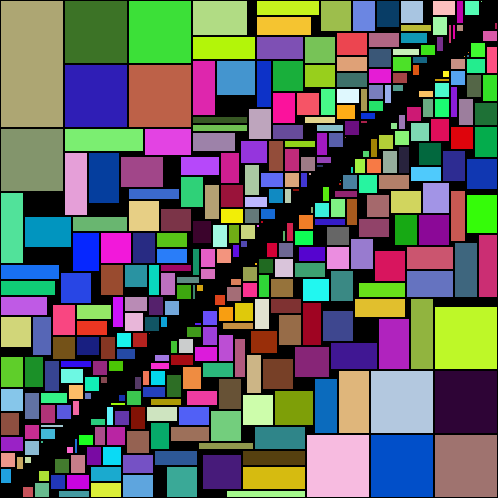

Attempts to pack rectangles into as small and square a space as possible by packing two opposing corners.

Works as follows:

1. Sort rectangles by descending perimeter.
1. Alternate between placing each rectangle in the "top-left" and "bottom-right" corners of an indeterminately sized rectangular region.
1. Place each rectangle as close to the corner as possible (e.g. as "up" and "to the left" as possible).
1. "Glue" each corner together, determining the final rectangular region and rectangle coordinates.

Performs poorly when there is a small number of rectangles with a large variance in size. Does not rotate rectangles.

For a general-use rectangle packer, use Kryptan's [rect-packer](https://github.com/kryptan/rect_packer).
